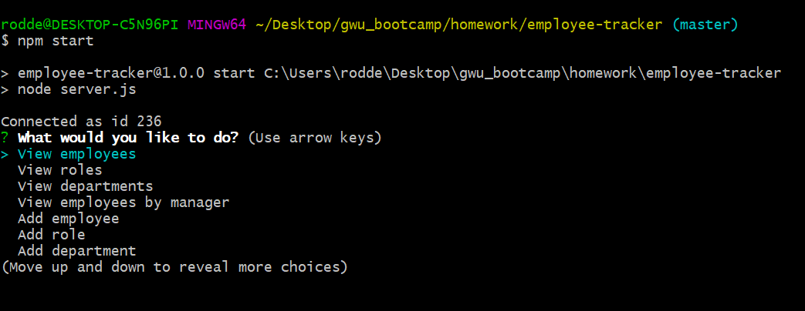
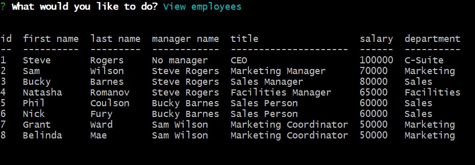
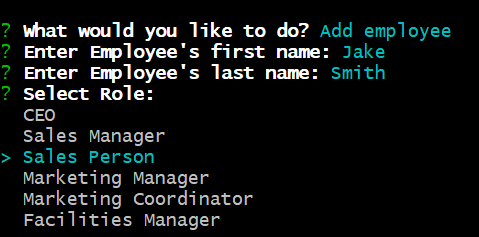

# Employee Tracker CMS

## Table of Contents
- [Project Overview](#project-overview) 
- [Installation](#installation)
- [Demo](#demo)
- [License](#license)
- [Screenshots](#screenshots)

## Project Overview
Command-line application that allows user to access a database hosted in mySQL to view, add and update employee records. Application built using Node.js and leveraging the mySQL and Inquirer packages from NPM (full list below). Data is hosted across three different tables that are related using inner joins on foreign keys in employees and roles tables.

### Languages Used
- JavaScript (Node.js)
- SQL (mySQL)

### Libraries Used
- [mySQL](https://www.npmjs.com/package/mysql)
- [Inquirer](https://www.npmjs.com/package/inquirer)
- [Console.table](https://www.npmjs.com/package/console.table)
- [Dotenv](https://www.npmjs.com/package/dotenv)

## Installation
Node.js is _required_ to use this application. Once cloned/downloaded from GitHub, run command "npm i" in command line to install the packages referenced under Libraries Used automatically. 

Then, make sure to update [.env.EXAMPLE](./.env.EXAMPLE) to hold your specific SQL credentials and database information so that the server.js file can connect to the server and update file name to .env. 

Then, create the SQL database by running the commands under in [seed.sql](./db/seed.sql). You should now be ready to launch the application by running the command "npm start."

## Demo
[View the demonstration video on YouTube](https://youtu.be/mUIUxW8tPXY)

## License
Permission is hereby granted, free of charge, to any person obtaining a copy of this Software and associated documentation files (the "Software"), to deal in the Software without  restriction, including without limitation the rights to use, copy, modify, merge, publish distribute, sublicense, and/or sell copies of the Software, and to permit persons to whom the Software is furnished to do so, subject to the following conditions.

[View the full license](./LICENSE).

## Screenshots

